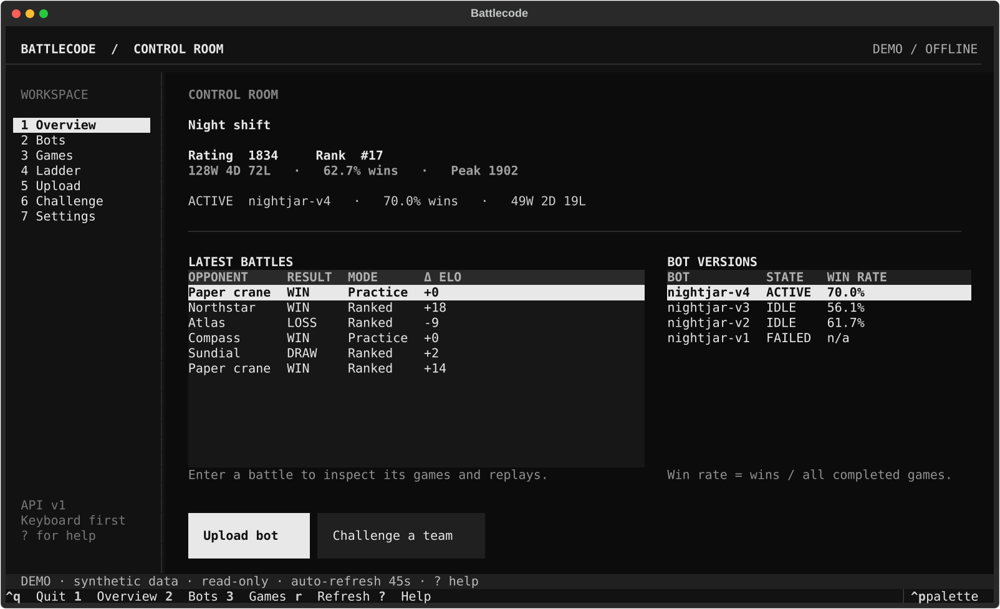
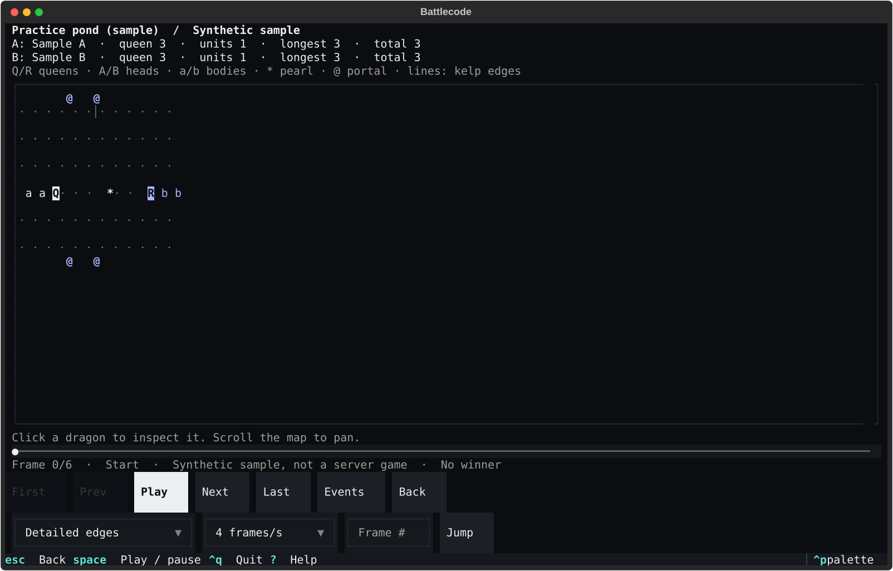
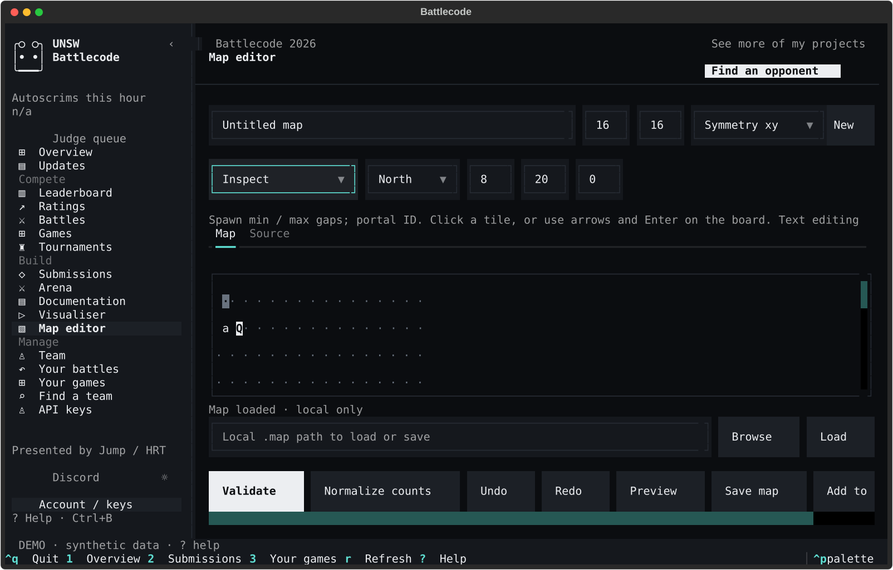

# battlecode-cli

A website-shaped terminal client for [UNSW Battlecode](https://game.battlecode.au), with the full navigation, team profiles, standings, submissions, battles, tournaments, documentation, replay visualiser and local map editor. **Arena sits directly beneath Submissions.** An optional browser companion is included.



## Install from GitHub

### macOS / Linux

```sh
curl -fsSL https://raw.githubusercontent.com/sebastianmiletic/battlecode-cli/v0.4.0/install.sh | sh
```

### Windows

Run in PowerShell, preferably inside Windows Terminal:

```powershell
irm https://raw.githubusercontent.com/sebastianmiletic/battlecode-cli/v0.4.0/install.ps1 | iex
```

These scripts install [uv](https://docs.astral.sh/uv/) if needed, obtain Python 3.13, install the versioned GitHub source archive into your user account, and configure PATH. No administrator access or shell alias is needed. Review the [shell](install.sh) or [PowerShell](install.ps1) script before executing it if you prefer.

**Open a new terminal**, then type:

```sh
battlecode-cli       # full terminal client
battlecode-cli --demo # synthetic preview, no account required
battlecode-cli web   # optional browser dashboard
```

`battlecode` remains a supported alias. The installer also prints the executable's full path for launching immediately in a terminal whose PATH has not refreshed.

### Install from a checkout

```sh
git clone https://github.com/sebastianmiletic/battlecode-cli.git
cd battlecode-cli
sh install.sh
```

On Windows, use `powershell -NoProfile -ExecutionPolicy Bypass -File .\install.ps1` instead of `sh install.sh`.

Already have uv and Git? Use `uv tool install --python 3.13 --from "git+https://github.com/sebastianmiletic/battlecode-cli.git@v0.4.0" battlecode-cli`, then `uv tool update-shell`. Python 3.11+ is supported; the installers choose 3.13.

Update by rerunning the installer from a current checkout. Uninstall with `uv tool uninstall battlecode-cli`; saved accounts and replay files are preserved. Delete saved API keys in the dashboard before uninstalling if you also want their local secrets removed.

## Full website-style TUI

The terminal follows the supplied website's **Overview / Updates**, **Compete**, **Build** and **Manage** navigation, not just its Overview. All 17 destinations have native work surfaces. Dark tinted neutrals, divided metrics, mint charts/focus, tables, tabs and profile sections follow the saved page. Terminal cells use your terminal font and a text brand mark; this is not browser-pixel or universal PNG rendering.

- **Compete:** searchable Leaderboard with members/institutions/eligibility, Ratings and history, public Battles/Games with pagination, and readable tournament brackets.
- **Build:** Submissions versions/upload, Arena Simulation/Online/Results, all 23 Documentation topics, Visualiser and a local Map editor.
- **Manage:** Team profile with members/records/eligibility/join requests, Your battles, Your games and Find a team.
- **Account / API keys:** verified named keys, one active account and explicit official-site account management.

Public announcements and global tables use bounded, credential-free official-page reads. Account records and actions use documented JSON endpoints. Original offline technical notes accompany the guide; refreshing a topic displays the full current official article as inert text. Team settings, stars, membership and account changes link to the official website because mutation APIs are not documented. No reference-account records are embedded as fake live data.

See [terminal views and controls](docs/terminal.md).

## Optional browser dashboard

`battlecode-cli web` opens a local browser dashboard with the supplied, unchanged Battlecode logo and reference-style sidebar, statistics row, tables and charts. `battlecode-cli web --demo` shows synthetic account data. No Node, cloud service or extra runtime dependency is needed. The server is loopback-only; Ctrl+C stops it and preserves finished simulation games. See [browser controls and security](docs/browser.md).

Arena includes all 15 official toolkit maps offline, checkbox map sets, your uploaded/local bots, shared opponents and repeats per map. Every finished game's replay is saved automatically. Games distinguishes **Ranked**, **Unranked** and **Simulation**; local runs never affect ELO. The browser player includes a draggable timeline, stepping, speeds, frame jump, map inspection and team statistics.

The browser retains its compact six-page layout; it does not replace the full native terminal navigation.

## First launch

With no connected account, the terminal opens **API keys** and focuses the hidden key field. In the browser, select **API keys** or continue using the offline Arena and replay library.

1. Click **Open team page**, then create a key at [game.battlecode.au/team](https://game.battlecode.au/team).
2. Paste it into the hidden input. Optionally give it a friendly account label.
3. Press `Enter` or click **Connect & save**. The app verifies `GET /me` before saving.

Creating a new key on the website invalidates the old one. Never paste your key into a chat or a shell command argument.

**Continue offline** opens the local replay library. **Try sample** demonstrates playback without an account. `battlecode-cli --demo` shows synthetic dashboard data and disables server mutations and API-key management.

## API-key management

Open **API keys (6)** to add, save, use, disconnect or delete named keys.

- **Exactly one saved profile is active.** Others remain saved but disconnected.
- **Save only** verifies and stores a key without changing the connected account.
- Switching verifies the selected key, confirms replacement of an existing connection and clears account-specific dashboard data.
- **Disconnect** keeps saved keys. It never falls back to another key.
- **Delete key** confirms removal of the local secret. It does not delete your team or revoke the server key. Revoke on the team page to disable a key everywhere.
- Existing environment/toolkit keys are offered for **explicit import**, not automatic login. Priority for this import is `BATTLECODE_API_KEY`, `UNSWBC_KEY`, the v0.1 app file, then `~/.unswbc/keys.json`.
- An account change from another terminal invalidates the dashboard's old connection and any pending write approval. Reconnect explicitly in API keys.

Secrets use the OS keyring when available. Linux/macOS without a keyring fall back to **unencrypted, owner-only files** (directory `0700`, key files `0600`). Windows requires Credential Manager and refuses plaintext fallback. Metadata and secrets stay outside the checkout; keys are not displayed or deliberately logged. Moving an OS-keyring-backed profile to another computer requires adding the key again.

```sh
battlecode-cli auth add                 # hidden prompt; verify, save and connect
battlecode-cli auth add --save-only     # save without connecting
battlecode-cli auth import              # explicitly import an existing key
battlecode-cli auth list                # labels/IDs, never the secrets
battlecode-cli auth use ACCOUNT_ID      # verify and switch
battlecode-cli auth status              # read-only access check
battlecode-cli auth disconnect
battlecode-cli auth delete ACCOUNT_ID   # confirmation; --yes for automation
battlecode-cli status                   # read-only team summary
```

`auth set` is an alias for adding a key. `auth clear` disconnects without deleting saved keys. `auth add --stdin` accepts a key from a secure pipeline, never as an argument.

## Mouse and keyboard

Click the sidebar, table rows, buttons, inputs and selectors. Use the wheel to scroll; forms and action bars scroll when the terminal is small. All workflows also support keyboard navigation. Recommended minimum: **80 × 24**, with larger terminals showing more data.

| Key | View / action |
| --- | --- |
| `1` | Overview: large ELO/rank, history plots, active bot, recent games |
| `2` | Submissions: versions, details, activation and Upload tab |
| `3` | Your games: Ranked/Unranked/Simulation and Local replays |
| `4` | Arena: Simulation, Online challenges and Results |
| `5` | Leaderboard: all teams, members, ELO and available win rates |
| `6` | API keys: account management and local file locations |
| `r` | Refresh |
| `Tab` / `Shift+Tab` | Move between controls |
| Arrows / `Enter` | Select and inspect table rows |
| `Ctrl+B` | Collapse / restore website navigation |
| `Ctrl+T` | Toggle dark / light theme |
| `Ctrl+K` | Documentation search |
| `Ctrl+p` | Command palette |
| `?` | Help |
| `Ctrl+q` | Quit |

Input fields keep typing precedence over navigation shortcuts. A supporting terminal is required for mouse reporting; keyboard controls work without a mouse. Hold your terminal's selection modifier (commonly Shift) if you want to select/copy terminal text instead.

The dashboard refreshes every 45 seconds (`--refresh 60` changes this). Failed requests preserve and label the last successful snapshot as stale. Rejected keys pause polling; writes are never retried automatically.

### Submissions and challenges

Win rate is **wins / (wins + draws + losses)**. Draws count in the denominator, not as half a win. No completed games or an incomplete record displays `n/a`; a wins-only leaderboard record is not treated as 100%.

Select a built inactive bot, click **Activate**, then confirm. ZIP downloads and build/per-map details are available on Submissions. Uploads require `bot.toml` at the ZIP root and a maximum ZIP size of 4 MB. Folder packaging follows `project.include`, excludes build output, checks for sensitive files, and never compiles or executes your source locally. Successful server builds may automatically become active.

Practice is the default. Ranked challenges are five-game series on server-selected maps and affect rating. Every upload, activation and challenge has a confirmation gate that defaults to Cancel. If a write times out, refresh before trying again because the server may have accepted it.

## Games and local replays

Select a series in **Your battles** or **Your games**, then an individual game. **View replay** downloads its official `.replay`, imports a local copy and opens the built-in player. **Download replay** only saves the file. Signed download URLs never receive your bearer key.

On **Your games → Local replays** (also reachable from Visualiser), browse for `.replay`, `.replay.gz`, or [supported replay JSON](docs/replay-format.md), then click **Import**. Click a library row or **Watch** to play. Imports are content-deduplicated local copies; removal confirms deletion of that copy and leaves your original file untouched.

**Replay imports are not server uploads.** Battlecode has no replay-upload API. No API key is needed to import, decode or watch a local file.



Player controls:

- **Play / pause**, playback speed, First/Last and single-frame stepping.
- `Space` toggles playback; `Left`/`Right` step; `Home`/`End` seek when a viewer control is focused.
- Click or drag the timeline, or enter a frame number and click **Jump**.
- Click a dragon/tile to inspect it. Scroll the map to pan.
- Detailed mode draws kelp and portal edges; compact mode hides edges and fits smaller terminals.
- Team statistics and **Events** expose lengths, living units, splits and deaths.
- `Esc` or **Back** returns to the dashboard.

```sh
battlecode-cli replay "path/to/game.replay"        # open the player
battlecode-cli replay "path/to/game.replay" --info # JSON summary, no UI or API request
```

Playback shows **round-end states**, not an action-by-action simulator. Sonar overlays, complete action logs and portal-link annotations are not implemented. The bounded decoder supports the current 2026 binary Cap'n Proto schema, packed/unpacked and gzip formats; it needs no native replay dependency. Safety limits reject very large or unsupported files. For the full official visualization, install the VS Code replay extension with `unswbc vscode` and open your downloaded file there.

Downloads and replay copies live in your platform's user-data directory. Paths are shown in API keys. Interrupted downloads do not replace existing files.

## Overview and live leaderboard

Overview plots server ELO history and locally observed ELO/rank snapshots. When the server supplies ELO history but not rank history, ranks are reconstructed against today's eligible teams and explicitly labelled **inferred**. Historical eligibility and tie ordering are not known. No history is invented for a new account.

Leaderboard reads `GET /leaderboard`, shows every returned team and its members, and supports name/member/ID search. It refreshes with the dashboard; **Refresh** forces a new read. Battlecode ranks teams, not individual users. The endpoint requires a valid API key. Where the server supplies only wins, win rate is `n/a`, not a fabricated percentage.

The top-right **See more of my projects** link opens the GitHub repository.

## Arena

1. Open **Arena (4)**. If needed, click **Install runner** and confirm the user-level installation of the official `unswbc` toolkit (about 200 MB). Alternatively: `uv tool install --python 3.13 'unswbc>=1.2.2,<2'`.
2. Choose two bot ZIPs or `bot.toml` project folders. On Submissions, **Arena A / Arena B** can download your own selected submission into either slot.
3. All 15 maps bundled with official `unswbc 1.2.2` are included and selected initially, even offline. Select a subset/map set, refresh official maps, or import a folder/ZIP containing hundreds of custom `.map`/`.txt` files.
4. Optionally add a folder of your other bots or other users' shared source projects/ZIPs, change repeats/seed/timeout, then **Review simulation** and confirm.
5. Watch Results, open any game's replay, read the full report or export JSON/CSV. Replays are saved automatically with the run and copied into the saved replay library. **Stop** keeps completed results. Previous batches remain available after restarting.

Both candidates play each shared opponent, plus each other, on every selected map. Seat swaps are on by default; repeats use the same seed schedule for fair comparisons. Bots and maps are snapshotted into a private workspace. Only the official **judge sandbox** runs bots; no native fallback is permitted. Runner processes receive OS/toolchain essentials, not Battlecode, AI-provider or GitHub credential environment variables.

Reports include W/D/L, win rates, per-map records, mean rounds, growth, splits, every recorded movement/command, sprint counts, queen-loss timing and death reasons. Rule-based improvement pointers suggest what to inspect, not proven strategic causes or AI analysis. Failed games are excluded from win rates. Map corrections are flagged; engine validation remains authoritative. See [Arena details and limits](docs/arena.md).

**Custom maps and local results stay local.** Local games are labelled **Simulation**, not Unranked, and do not affect ELO. Other teams' private bot source cannot be downloaded through the API; use shared local sources to benchmark them. **Arena → Online** challenges a team's active bot using your active server bot, defaulting to unranked. It does not compare two inactive server submissions or upload custom maps.

## Local map editor

Create a map, paint pearl spawns, kelp, paired portals and starting queens, or edit the complete official text format in **Source**. Click tiles, or use arrows and Enter on the board. Dimensions, symmetry, edge direction, spawn gaps and portal IDs are editable. Undo/redo and count normalization are available.

**Validate** checks directives, counts, bounds, alternating starting teams, adjacent non-overlapping bodies and portal pairs. **Preview** is a read-only starting-state view. **Save map** reviews the destination; **Add to Arena** reviews a local custom-library copy. Neither uploads a file nor starts execution. The official engine remains authoritative.



## Claude / Codex

AI chat is **not implemented**. [The integration proposal](docs/ai-integration.md) explains two routes: expose safe Battlecode tools to Claude Code/Codex using MCP, or add an in-app chat view using an official provider SDK/CLI. Both should start read-only, share only explicitly selected context, and retain human approval for every server mutation.

## Development

```sh
uv sync --group dev
uv run pytest -q
uv run ruff check .
uv run ruff format --check .
uv run battlecode-cli --demo
uv tool install --editable .
```

CI tests Python 3.11/3.13 on macOS, Linux and Windows, builds the package and verifies the installed commands. Native UI tests include the full navigation, map editing, profiles, bracket links, account isolation and 80×24 layouts. A separate Chromium job checks the browser workflows and mobile layout. Tests use mocked server HTTP, an in-memory keyring, temporary files and an isolated loopback server; actual Battlecode requests are prohibited. No real bots are uploaded, activated or challenged during tests.

Official [API documentation](https://game.battlecode.au/docs/api). Server permissions, build states, quotas and rate limits still apply. This is an unofficial client. MIT licensed.
