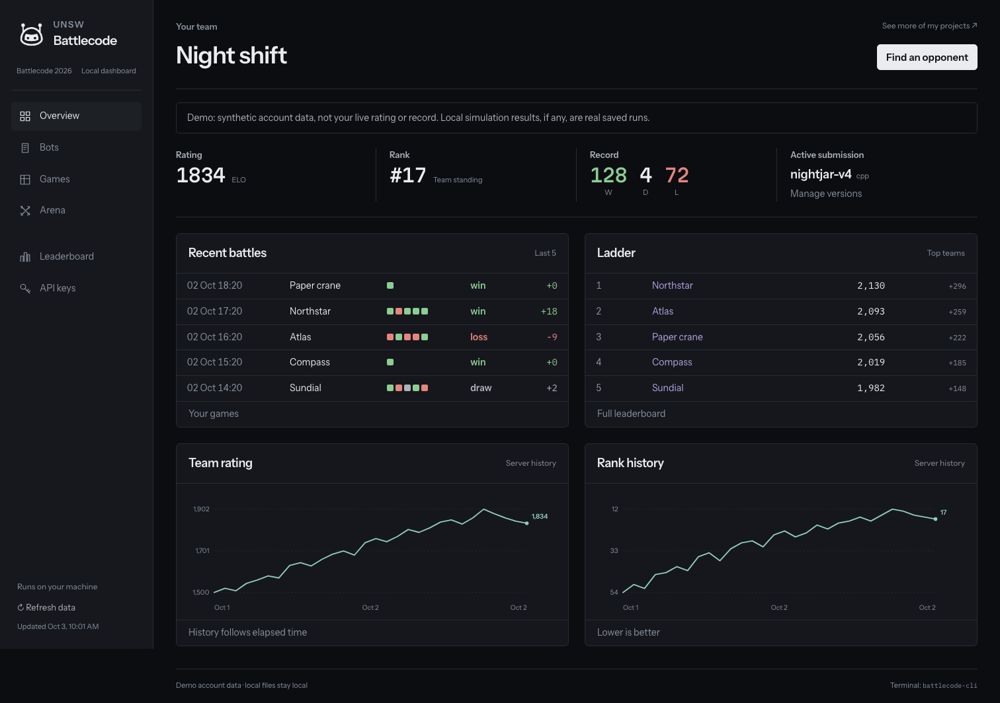
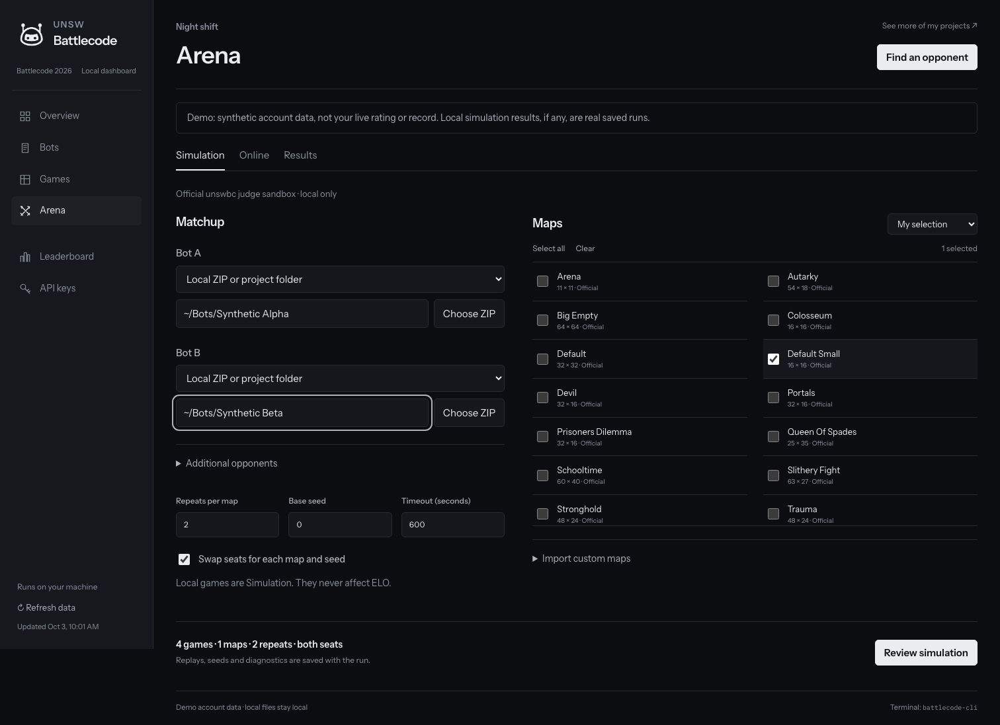
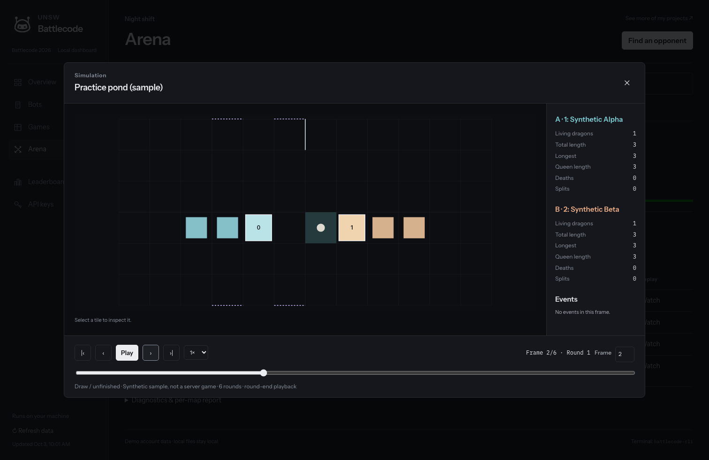

# Local browser dashboard

```sh
battlecode-cli web
battlecode-cli web --demo
battlecode-cli web --no-browser --port 8765
```

The first command opens your default browser and keeps the server in the terminal. The default uses a free port on `127.0.0.1`. Ctrl+C closes the dashboard and stops an active simulation, preserving finished games. `battlecode-cli` still opens the terminal interface. No Node, web build step, cloud service or extra Python dependency is required.

## Overview

The browser interface follows the supplied Battlecode reference: fixed dark sidebar, unchanged supplied PNG, Instrument Sans labels, mono figures, a divided statistics row, recent battles and nearby standings, and two history panels. Rank history replaces the reference's schedule panel because no unsupported schedule data is invented. It is an unofficial local client, not a copy of the hosted service.

The logo bytes, aspect ratio and colors are unchanged. It is rendered at a sidebar-appropriate size. Fonts are bundled for offline use with their OFL licenses. Screenshots use explicitly labelled synthetic account data, never real keys or account screenshots.



Live team data requires a valid saved key. Add it in **API keys**, using the hidden field. Only one account is connected. Verification, switching, save-only, confirmed deletion and disconnect use the same private account store as the terminal. The browser never receives a saved Battlecode key; a newly entered key is sent only to the loopback server for verification and storage, then cleared from the input. There is no key-bearing URL, browser localStorage or request logging.

## Simulation

1. Open **Arena → Simulation**. Confirm **Install runner** if `unswbc` is missing.
2. Select two of your own uploaded versions, choose local ZIPs, or enter `bot.toml` project folders. Own versions are downloaded read-only; another team's private source is not available.
3. Select **All official maps**, **Custom maps**, **All stored maps**, or a checkbox subset. All 15 maps from official `unswbc 1.2.2` are bundled and selected initially. New official map text is also imported when the server supplies it.
4. Set repetitions per map, seed and timeout. Both seats are on by default. Total games are shown before confirmation. An optional folder supplies shared opponents; both candidates play each opponent, plus each other.
5. Review the source/map snapshot and total games, then confirm. Results update without blocking navigation. Stop preserves completed results.



Only the official judge sandbox executes bots. There is no native fallback. All completed-game replay files are saved inside the run, and content-deduplicated copies are added to **Games → Saved replays** automatically. If the 1,000-replay library is full or copying fails, the original run replay is retained and the result records the library issue.

Local games are always **Simulation**, including historical batches and the Games filter. They are not Unranked and do not affect ELO. **Arena → Online** is a separate active-server-bot challenge workflow, unranked by default. Upload, activate and challenge require confirmation and are never retried automatically.

## Playback and inspection

Watch a Results row or a saved replay. The Canvas board shows dragons, pearls, fountains and terrain edges. The viewer has play/pause, speeds, first/last, stepping, a clickable/draggable native timeline and a numeric frame jump. Team statistics and frame events follow the selected round-end state. Click a tile to inspect it; wheel to zoom, Shift-drag to pan. Escape closes the player. Replay pages are fetched in bounded groups instead of sending an entire large replay at once.



JSON and CSV exports require review and use the browser's download handling. CSV formula-leading values are escaped. Reports distinguish recorded diagnostics from causal strategy claims. Sources and credentials are not included in browser result exports. See [Arena limits](arena.md) and [replay details](replay-format.md).

## Local request security

The server binds only IPv4 loopback, not the LAN. It checks the exact Host and Origin, uses an HttpOnly SameSite=Strict session cookie, and requires a session-specific CSRF header for every write. No CORS is enabled. CSP blocks external scripts, eval, frames and third-party requests; all fonts and assets are local. Untrusted team names, maps, replay events and logs are escaped or assigned as text. Static paths are allowlisted, and API responses redact Battlecode keys.

Approvals are single-use, expire after three minutes, and are bound to the current account and exact prepared operation. A new review invalidates the previous one. Changing accounts outside the dashboard detaches the old connection; connecting the newly selected saved key still requires an explicit action. Temporary file-picker copies are private and deleted on shutdown; original user files are not deleted. Folder imports use an entered local path, while browser file choosers support ZIPs and individual files.

The loopback interface is for your own browser, not a public API or MCP server. Do not expose the port with a proxy or port forwarding. Local programs running as your user already have the same filesystem privileges; loopback request protections are not an isolation boundary against local malware. Bot execution remains the responsibility of the official judge sandbox.

## Verification

```sh
uv run pytest -q
uv run --with playwright python -m playwright install chromium
uv run --with playwright python scripts/browser_smoke.py --output /tmp/battlecode-browser-check
```

The browser check isolates account/data directories and uses synthetic fixtures. Optional `--sandbox-templates PATH` instead compares two official C++ starter copies in the real sandbox. It never uploads, activates or challenges a real bot.
