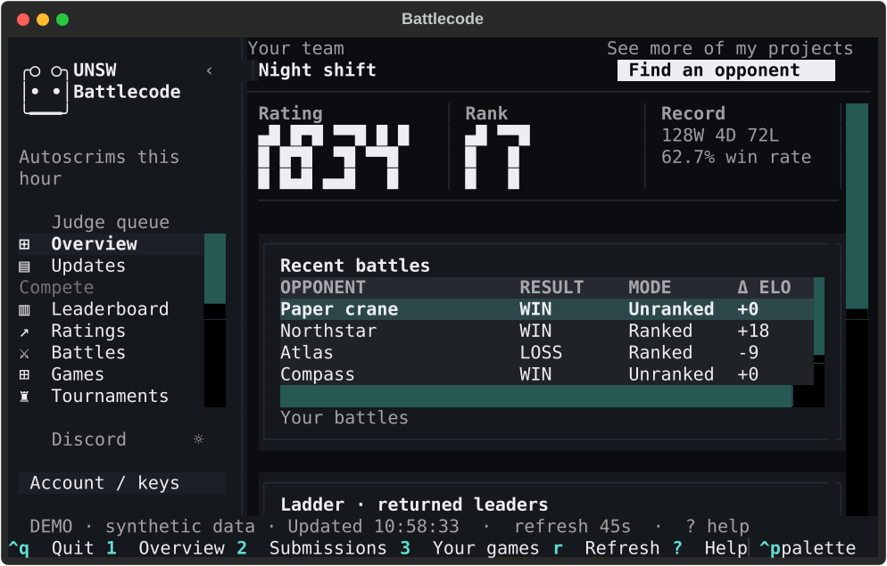
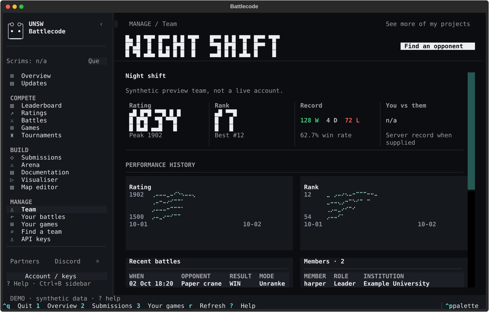
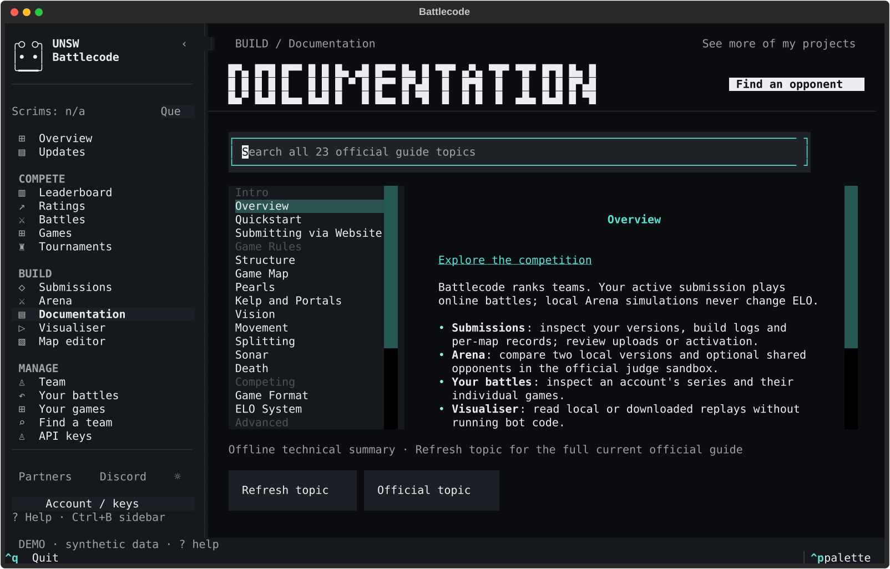

# Full website-style terminal client

```sh
battlecode-cli
battlecode-cli --demo
```

The saved Battlecode website determines the full navigation, profile structure and dark styling. **Arena is directly beneath Submissions**. This is a native Textual/Rich interface, not a browser window or Rust/Ratatui rewrite. Your terminal supplies the monospace font and character-cell geometry; the text brand mark does not claim byte-for-byte PNG rendering.


## Navigation and data

| Group | View | Working surface |
| --- | --- | --- |
| Home | Overview | Rating/rank/record/active version, recent battles, returned ladder, honest history |
| Home | Updates | Current official public announcements, parsed as inert text |
| Compete | Leaderboard | All returned teams, records, members, institutions, eligibility, search and profile/challenge actions |
| Compete | Ratings | Team selection, ELO/rank charts and searchable rating rows |
| Compete | Battles | Public battle table, mode/search filters, pagination and game inspection |
| Compete | Games | Public game table, mode/search filters, pagination and replay access |
| Compete | Tournaments | Tournament table, expandable bracket and battle links |
| Build | Submissions | Versions, build/per-map logs, own ZIP downloads, reviewed upload/activation and Arena source selection |
| Build | Arena | Local Simulation, reviewed Online challenges and saved Results |
| Build | Documentation | All 23 official topic labels, searchable original offline notes, full current topic refresh |
| Build | Visualiser | Local file picker, replay library, sample playback and Simulation Results |
| Build | Map editor | Terrain/queen brushes, source editing, count normalization, undo/redo, validation, preview and confirmed local saves |
| Manage | Team | Profile facts/charts, recent battles, members, eligibility and supplied join requests |
| Manage | Your battles | Account battle series, filtering, individual games, available queue position and judge log |
| Manage | Your games | Account results and a bounded local Simulation index, plus saved replays |
| Manage | Find a team | Team/member/institution search, profile/eligibility filters and challenge actions |
| Account | API keys | Hidden verified key entry, named accounts, one active profile and explicit website account link |

Account records use documented JSON endpoints and require a valid key. Global announcements/matches use the official public pages with no credentials, no redirects, no executed scripts and a 2 MB bound. Public-page snapshots are cached briefly; pagination is read-only. An API key is still needed for server game/replay JSON access.

Team settings, membership, join-request approval, stars, skins, autoscrims and account edits are **website-only operations**. The terminal presents supplied state and explicit official-site links, not undocumented writes. Missing records, eligibility, head-to-head statistics or historical peaks display n/a. An absent denominator is not a zero-loss or 100% record. Demo data is synthetic, not the supplied reference team's data.

## Keyboard, mouse and compact layouts

| Key | Action |
| --- | --- |
| 1 / 2 / 3 | Overview / Submissions / Your games |
| 4 / 5 / 6 | Arena / Leaderboard / API keys |
| Ctrl+B | Collapse/restore sidebar; its restore rail remains clickable |
| Ctrl+T | Dark/light theme |
| Ctrl+K | Documentation search |
| Ctrl+P | Command palette |
| Tab / Shift+Tab | Next/previous control |
| Arrows / Enter | Select and inspect rows, menu topics or bracket matches |
| r | Refresh the current feed, outside text controls |
| ? | Keyboard help |
| Ctrl+Q | Quit |

At **80×24**, the full sidebar scrolls, facts/profile panels stack, charts shorten, and wider tables/actions scroll horizontally. Forms and map/replay viewports scroll independently. Larger terminals expose the complete navigation at once. Clicking rows, buttons, tabs and timeline controls is supported, but a mouse is not required.



## Team profiles and tournaments



Selecting a leaderboard/directory/rating row opens the documented public team profile. The first viewport shows its facts rather than jumping down to Members. Your own profile comes from the active account; switching/disconnecting clears member/request/profile/rating/bracket state and cancels pending account-bound reads.

Tournament brackets are bounded expandable trees. Select a match node with a supplied battleId/matchId to inspect its games. Unknown server fields remain readable instead of assuming an undocumented bracket schema.

## Documentation



All 23 topic labels follow the official Intro, Game Rules, Competing and Advanced outline. Bundled notes are original technical summaries, not copies of the website articles. **Refresh topic** reads the full current official guide as inert Markdown-style text; cached text remains available for the session. Official links stay on the HTTPS Battlecode host. No website scripts, styles, forms or credential cookies are executed.

## Map editor


1. Set a name, width, height and spawn symmetry, then **New**. New maps range from 4×4 to 128×128; imported maps retain the decoder's bounded geometry.
2. Select Inspect, Pearl spawn, Kelp edge, Portal edge, Queen A/B, or an erase brush. Choose edge direction, spawn min/max gaps and portal pair ID.
3. Click a tile, or focus the board and use arrows followed by Enter. The selected coordinate scrolls into view.
4. Use **Source** for all official directives and starting dragon bodies. Edits preserve a draft undo/redo history. **Normalize counts** groups records and fixes TILE_COUNT/EDGE_COUNT/DRAGON_COUNT, retaining a final END marker when present.
5. **Validate** checks source bounds, directives, counts, paired portal orientations, alternating starting teams, adjacent bodies and overlaps. Validation errors remain visible at 80×24.
6. **Preview** opens a read-only starting-state view. **Save map** confirms the exact destination and refuses if it changed during review. **Add to Arena** confirms a local custom-library copy, without uploading or running anything.

Loading a map does not change its original file; replacing an unsaved draft requires review. File size is bounded to 1 MB, history to 50 drafts, and simultaneous reviewed map operations are prevented. Official engine validation remains authoritative.

## Simulation and replay separation

All 15 unchanged official toolkit maps are bundled offline. Arena supports Official/Custom/All stored sets, checkbox subsets, repeats, base seeds and seat swaps. Execution is reviewed and uses only the official unswbc judge sandbox. Finished replay copies are automatically added to the local library, with readable version labels stored outside the unchanged replay bytes.

**Your games** filters Ranked, Unranked and **Simulation**. Its local index is bounded to the newest 1,000 games from the recent saved batches; complete original batches and reports remain in Arena Results. Simulations are not server games and never change ELO. Crashes/unfinished games are errors, not decided-game wins.

The terminal viewer supports playback, speed, first/last, stepping, mouse timeline seeking, frame jump, map pan and tile inspection. It displays round-end states, not an action-by-action simulator. Recorded-command diagnostics are separate from the display frames. Sonar overlays and portal-link annotations are not implemented.

## Verification and limitations

Native tests use mocked server HTTP, isolated accounts/maps/replays, synthetic fixtures and 80×24/130×40 layouts. Documentation screenshots contain no real keys, user libraries or reference-team records. Package CI includes Python 3.11/3.13 on Windows, Linux and macOS. Live authenticated validation needs a valid key and is separate from local/mocked testing; no real submissions or challenges are sent during verification.

See [account safety](../README.md#api-key-management), [Arena limits](arena.md), [replay format](replay-format.md) and the optional [browser companion](browser.md).
